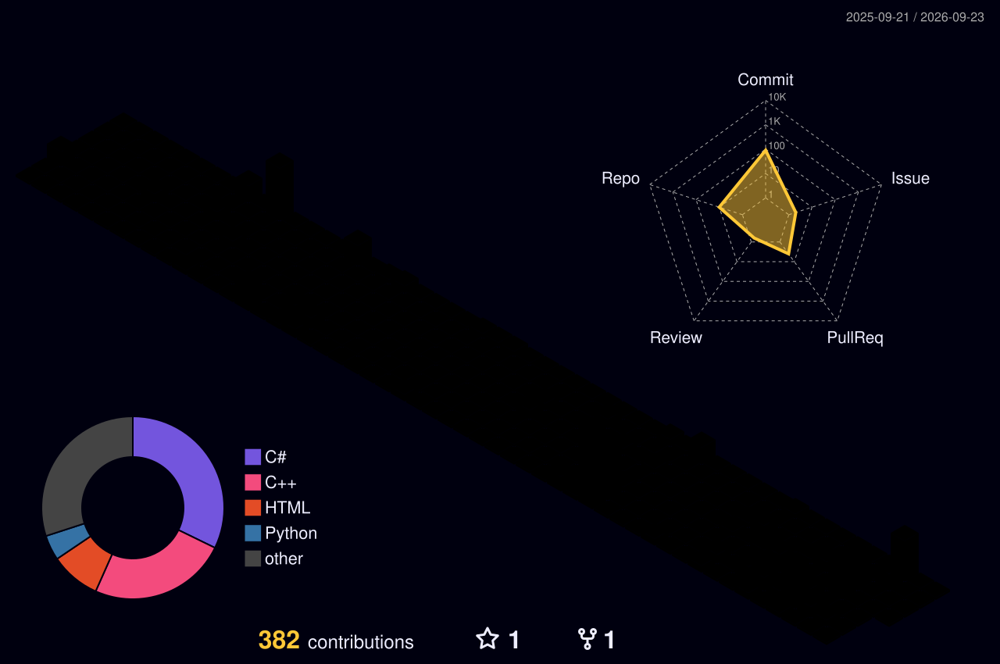

###  Nice ways to reach me
<a href="https://velog.io/@yeuljliyn/posts" target="_blank">
<a href="mailto:elly3385@gmail.com" target="_blank">

----

Hi! I’m a Metaverse & Game Studies student crafting games — from gameplay logic to cinematic cutscenes in Unity and Unreal. I care about smooth controls, clear structure, and emotionally engaging interactions. 🎥

----
### Personal stats:

  
Highlights / Proficiencies

   

  <strong>Highlights</strong>  
  - ⭐ Developed <em>Tales in Fragments</em>, an emotion-recognition based interactive storytelling game using Unity, Cinemachine, and iPhone Live Capture.  
  - ⭐ Built VR/MR-based virtual hospital training content as a Unity programmer in a cross-disciplinary team (nursing · animation · game).  
  - ⭐ Implemented combat systems, state machines, and camera effects for an action RPG shooter prototype (<em>Hafly</em>), which received a departmental encouragement award.  
  - ⭐ Set up a GitHub collaboration workflow for multi-member Unity projects, reducing build conflicts and improving team productivity.

   

  <strong>Proficiencies</strong>  
  - 📚 Languages: C#, C++, Python, Java  
  - 🎮 Game Engines & Tools: Unity, Unreal Engine, Cinemachine, Timeline  
  - 🧠 AI & Computer Vision: Python, OpenCV, basic reinforcement learning & media processing  
  - 🔧 Collaboration & Etc.: Git, GitHub, Notion

### 💪 Skills

----

